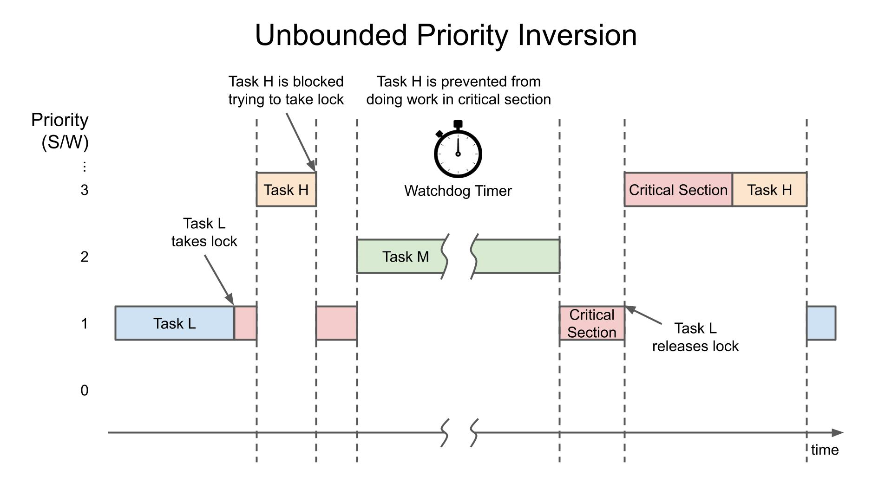

# 4.4BSD scheduler

TL;DR: Read the [B.5 Summary](https://www.scs.stanford.edu/24wi-cs212/pintos/pintos_7.html#SEC136)
section for the laboratiry implementation details.

A 4.4BSD scheduler, as described in [The Design and Implementation of the 4.4BSD Operating System]:

> The traditional 4.4BSD scheduler employs a “multilevel feedback queues” algorithm, favouring
> interactive, short-running threads to CPU-bound ones.
>
> From: <https://man.bsd.lv/NetBSD-9.2/sched_4bsd.9>

"Multilevel feedback queues" means it maintains several queues of ready-to-run threads, each
queue holding threads with a different priority.

At any given type, the shceduler chooses a thread from the highest-priority non-empty queue.
If this queue contains multiple threads, they run in round-robin fashion.


Fig 1. Round robin scheduling.

## Understanding priorities

Running threads have different priority. Priority can be understand in terms of **fast response**,
and **more CPU time**. Threads that perform I/O require fast response to keep I/O devices busy,
but need little CPU time. Threads with heavy compute-bound tasks need to receive a lot of CPU time,
but have no requirements for fast response time.

## Priority inversion

Priority inversion happens when a task of lower priority take precedence, indirectly, over another
with higher priority. This happens of systems with more than two priority levels.



As you can see in the image, task M (with medium priority) is indirectly delaying task H, just
because task L (lower than M) is blocking a resource that H needs.

A partial solution to this problem is **Priority inheritance**³ (also called **Priority donation**).

As it name suggests, in the example above, task L would **inherit** the priority of task H while
locking the resource, so that M would not delay H. Once L exits its critical section, it regains
its original (low) priority. This way M would not preempt L, and L will complete as soon as
possible³.

The 4.4BSD scheduler does not include priority inheritance¹.

### Niceness

The niceness (not to be confused with priority) is an integer value that determines how "nice" the
thread should be to other threads.

Niceness ranges from -20 to 20. A thread with a "nice" of zero does not affect its priority.
A "pretty nice" thread decreases its priority, because it feels that other threads deserves it
better. On the other hand, threads with negative niceness take away CPU time from other threads,
just like the ruthless selfish resouce-hogging parasites they are.

## Calculating priority

Thread priority is dynamically determined by the scheduler using the following formula

$
priority = PRI\_MAX - (recent\_cpu / 4) - (nice * 2),
$

Where `recent_cpu` is an estimate of the CPU time the thread has used recently, and this is key to
prevent starvation: a thread that has not receive any CPU recently (`recent_cpu=0`) will have its
priority increased.

Thread priority is calculated in thread initialization and recalculated once every foruth clock tick.

Pintos define the priority constants:

```c
#define PRI_MIN 0
#define PRI_DEFAULT 31
#define PRI_MAX 63
```

## Calculating `recent_cpu`

Further details in [Calculating recent_cpu](https://www.scs.stanford.edu/24wi-cs212/pintos/pintos_7.html#SEC134).

We must implement `int thread_get_recent_cpu (void)` in [thread.c](../src/threads/thread.c), which
returns 100 times the current thread's recent cpu_value.

> Why "100 times"? Because otherwise we would lose precision, as this parameter should be treated
> as a floating point number, which Pintos doesn't support.

More recent CPU time should be weighted more heavily than less recent CPU time.

What you may thing is to store CPU used in the last N seconds using an array of N elements, however
this approach uses O(n) space and O(n) time to perform a weighted calculation.

It instead uses an exponential moving average (EMA), which is more efficient and gives more weight
to the most recent values.

The formula is as follows:

$
recent\_cpu = (2*load\_avg)/(2*load\_avg + 1) * recent\_cpu + nice
$

## Calculating `load_avg`

Further details in [Calculating load_avg](https://www.scs.stanford.edu/24wi-cs212/pintos/pintos_7.html#SEC135).

We must implement `int thread_get_load_avg (void)` in [thread.c](../src/threads/thread.c), which
returns 100 times the current system load average.

Also known as the system load average, it's the exponentially weighted moving average of the number
of threads ready to run over the past minute.

As you may have guessed, this parameter is system wide, unlike `recent_cpu`, which is
thread-specific.

$
load\_avg = (59/60)*load\_avg + (1/60)*ready\_threads
$

## References

1. Pintos 4.4BSD Scheduler. Stanford: <https://www.scs.stanford.edu/24wi-cs212/pintos/pintos_7.html#SEC131>
2. 4.4BSD scheduler. FreeBSD: <https://man.freebsd.org/cgi/man.cgi?query=sched_4bsd&sektion=4&n=1>
3. Priority inheritance. Wikipedia: <https://en.wikipedia.org/wiki/Priority_inheritance>
4. Moving average. Wikipedia: <https://en.wikipedia.org/wiki/Moving_average>
