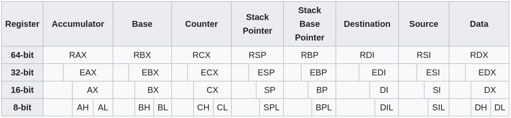

# x86 Assembly reference

Pintos x86 assembly reference from various sources.

## Registers

### General-Purpose Registers

Source: <https://en.wikibooks.org/wiki/X86_Assembly/X86_Architecture>

> BIOS uses the 16-bit version of the registers, while the OS uses 32-bit versions.

### Segment registers

- Stack Segment (SS). Pointer to the stack ('S' stands for 'Stack').
- Code Segment (CS). Pointer to the code ('C' stands for 'Code').
- Data Segment (DS). Pointer to the data ('D' stands for 'Data').
- Extra Segment (ES). Pointer to extra data ('E' stands for 'Extra'; 'E' comes after 'D').
- F Segment (FS). Pointer to more extra data ('F' comes after 'E').
- G Segment (GS). Pointer to still more extra data ('G' comes after 'F').

> Most applications on most modern operating systems (like FreeBSD, Linux or Microsoft Windows)
> use a memory model that points nearly all segment registers to the same place (and uses paging
> instead), effectively disabling their use.

We see them used, however, in Pintos loader code.

### EFLAGS register

| N       | Description                                                                                                                                                                                                                                                                                                  |
| ------- | ------------------------------------------------------------------------------------------------------------------------------------------------------------------------------------------------------------------------------------------------------------------------------------------------------------ |
| JO      | Jump if overflow                                                                                                                                                                                                                                                                                             |
| 0.      | CF : Carry Flag. Set if the last arithmetic operation carried (addition) or borrowed (subtraction) a bit beyond the size of the register. This is then checked when the operation is followed with an add-with-carry or subtract-with-borrow to deal with values too large for just one register to contain. |
| 2.      | PF : Parity Flag. Set if the number of set bits in the least significant byte is a multiple of 2.                                                                                                                                                                                                            |
| 4.      | AF : Adjust Flag. Carry of Binary Code Decimal (BCD) numbers arithmetic operations.                                                                                                                                                                                                                          |
| 6.      | ZF : Zero Flag. Set if the result of an operation is Zero (0).                                                                                                                                                                                                                                               |
| 7.      | SF : Sign Flag. Set if the result of an operation is negative.                                                                                                                                                                                                                                               |
| 8.      | TF : Trap Flag. Set if step by step debugging.                                                                                                                                                                                                                                                               |
| 9.      | IF : Interruption Flag. Set if interrupts are enabled. We use it in start.S to temporally disable interrupts while switching to protected mode.                                                                                                                                                              |
| 10.     | DF : Direction Flag. Stream direction. If set, string operations will decrement their pointer rather than incrementing it, reading memory backwards.                                                                                                                                                         |
| 11.     | OF : Overflow Flag. Set if signed arithmetic operations result in a value too large for the register to contain.                                                                                                                                                                                             |
| 12, 13. | IOPL : I/O Privilege Level field (2 bits). I/O Privilege Level of the current process.                                                                                                                                                                                                                       |
| 14.     | NT : Nested Task flag. Controls chaining of interrupts. Set if the current process is linked to the next process.                                                                                                                                                                                            |
| 16.     | RF : Resume Flag. Response to debug exceptions.                                                                                                                                                                                                                                                              |
| 17.     | VM : Virtual-8086 Mode. Set if in 8086 compatibility mode.                                                                                                                                                                                                                                                   |
| 18.     | AC : Alignment Check. Set if alignment checking of memory references is done.                                                                                                                                                                                                                                |
| 19.     | VIF : Virtual Interrupt Flag. Virtual image of IF.                                                                                                                                                                                                                                                           |
| 20.     | VIP : Virtual Interrupt Pending flag. Set if an interrupt is pending.                                                                                                                                                                                                                                        |
| 21.     | ID : Identification Flag. Support for CPUID instruction if can be set.                                                                                                                                                                                                                                       |

## ASM Interrupts

For interrupt codes, see:

 &nbsp;&nbsp;Ralf Brown's Interrupt List: <http://www.ctyme.com/intr/int.htm>

Interrupt list: <http://guideme.itgo.com/atozofc/ch71_1.pdf>

> Ralf Brown is a well-known authority for maintaining both documented and undocumented BIOS
> interrupts, DOS interrupts, memory map and other system-oriented information.
>
> Because of him only, the world came to know so many officially undocumented interrupts and
> system specific information. His work is appreciated throughout the world by thousands of
> DOS Programmers. The complete list runs up to thousands of pages!
>
> Many thanks to Dr. Ralf Brown!

## Jumps

Reference: <http://www.unixwiz.net/techtips/x86-jumps.html>

| Instruction       | Description                                                      | signed   | Flags               |
| ----------------- | ---------------------------------------------------------------- | -------- | ------------------- |
| JO                | Jump if overflow                                                 |          | OF = 1              |
| JNO               | Jump if not overflow                                             |          | OF = 0              |
| JS                | Jump if sign                                                     |          | SF = 1              |
| JNS               | Jump if not sign                                                 |          | SF = 0              |
| JE  JZ            | Jump if equal Jump if zero                                    |          | ZF = 1              |
| JNE JNZ        | Jump if not equal Jump if not zero                            |          | ZF = 0              |
| JB JNAE JC  | Jump if below Jump if not above or equal Jump if carry     | unsigned | CF = 1              |
| JNB JAE JNC | Jump if not below Jump if above or equal Jump if not carry | unsigned | CF = 0              |
| JBE JNA        | Jump if below or equal Jump if not above                      | unsigned | CF = 1 or ZF = 1    |
| JA JNBE        | Jump if above Jump if not below or equal                      | unsigned | CF = 0 and ZF = 0   |
| JL JNGE        | Jump if less Jump if not greater or equal                     | signed   | SF <> OF            |
| JGE JNL        | Jump if greater or equal Jump if not less                     | signed   | SF = OF             |
| JLE JNG        | Jump if less or equal Jump if not greater                     | signed   | ZF = 1 or SF <> OF  |
| JG JNLE        | Jump if greater Jump if not less or equal                     | signed   | ZF = 0 and SF = OF  |
| JP JPE         | Jump if parity Jump if parity even                            |          | PF = 1              |
| JNP JPO        | Jump if not parity Jump if parity odd                         |          | PF = 0              |
| JCXZ JECXZ     | Jump if %CX register is 0 Jump if %ECX register is 0          |          | %CX = 0 %ECX = 0 |
