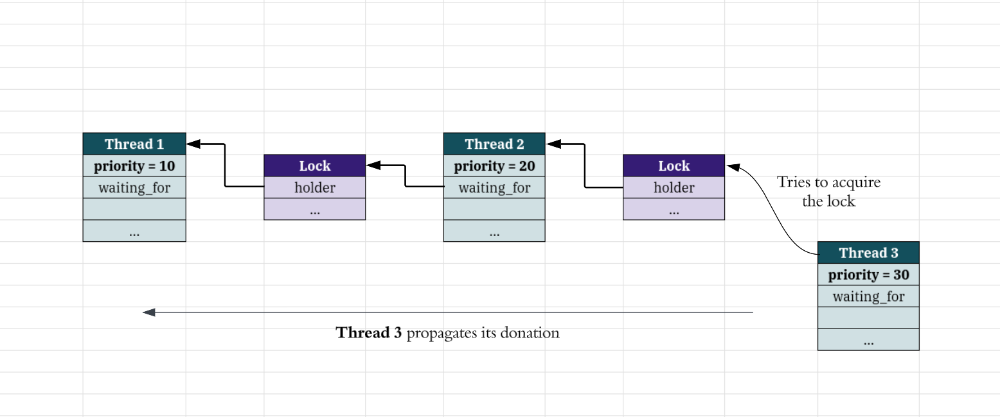

<!-- markdownlint-disable MD033 MD024 MD041 -->

<div align="center">

<h2>Project 1: Threads</h2>

Operating Systems — National University of San Marcos

</div>

### Group

- Damaris Del Carpio [damaris.delcarpio@unmsm.edu.pe](mailto:damaris.delcarpio@unmsm.edu.pe)
- Paolo Flores [paolo.flores2@unmsm.edu.pe](mailto:paolo.flores2@unmsm.edu.pe)

### Preliminaries

> Please cite any offline or online sources you consulted while
> preparing your submission, other than the Pintos documentation, course
> text, lecture notes, and course staff.

1. Assembly x86 Architecture. Wikibooks. <https://en.wikibooks.org/wiki/X86_Assembly/X86_Architecture>
2. The 4.4BSD scheduler manual. FreeBSD. <https://man.freebsd.org/cgi/man.cgi?query=sched_4bsd&sektion=4&n=1>
3. Priority inheritance/donation. Wikipedia. <https://en.wikipedia.org/wiki/Priority_inheritance>
4. Context Switch. Wikipedia. <https://en.wikipedia.org/wiki/Context_switch>
5. Yield in multithreading. Wikipedia. <https://en.wikipedia.org/wiki/Yield_(multithreading)>
6. Kernel Preemption. Wikipedia. <https://en.wikipedia.org/wiki/Kernel_preemption>
7. Preemption in the Linux kernel. Kernel newbies. <https://kernelnewbies.org/FAQ/Preemption>
8. Linux Kernel Scheduling. Wikipedia. <https://en.wikipedia.org/wiki/Linux_kernel#Scheduling>

## Alarm Clock

Git diff — <https://github.com/proyectitos-fisi/pintos/pull/1/files>

### Data Structures

> **A1:** Copy here the declaration of each new or changed `struct` or
> `struct` member, global or static variable, `typedef`, or
> enumeration.  Identify the purpose of each in 25 words or less.

Threads now maintain a `wakeup_tick` field to store the tick when they
should wake up. This is only meaningful for threads in the `sleep_list`.

```c
// Added to struct thread (thread.h)

int64_t wakeup_tick;    /* The tick to wake up the thread */
```

And to keep track of sleeping threads, a global list was created.
Threads in this list are waiting to be woken up by the timer interrupt
handler.

```c
// Added to global scope (thread.c)

static struct list sleep_list;
```

### Algorithm

> **A2:** Briefly describe what happens in a call to `timer_sleep()`,
> including the effects of the timer interrupt handler.

When a thread calls `timer_sleep()`:

- The algorithm first checks for interrupts to be **enabled**, because unblocking depends
  on the timer interrupt handler.

- The thread calculates its `wakeup_tick` and adds itself to the `sleep_list`, in a
  `THREAD_BLOCKED` state.

- Then, a `schedule()` call **forces a context switch**. The next thread to run will be
  the one with the highest priority, replacing the current one.

- The timer interrupt handler continuously checks the `sleep_list` and unblocks threads
  whose `wakeup_tick` has passed.

> **A3:** What steps are taken to minimize the amount of time spent in
> the timer interrupt handler?

To minimize the time spent in the timer interrupt handler:

- Each time we are about to insert a thread into the `sleep_list`, we check if it should
  be woken up immediately. If so, we don't sleep and return.

- The `sleep_list` is sorted by `wakeup_tick` in ascending order. Thus the interrupt
  handler only checks from the beginning of the list until it finds a thread that should
  not be woken up yet.

### Synchronization

> **A4:** How are race conditions avoided when multiple threads call
> `timer_sleep()` simultaneously?

Critical sections of the code, like modifying the `sleep_list`, are run with interrupts
disabled. This ensures that no other thread can interrupt the current one and modify
the list at the same time.

Furthermore, due to the fact that Pintos is a single processor system, threads **cannot**
really call `timer_sleep()` simultaneously.

> **A5:** How are race conditions avoided when a timer interrupt occurs
> during a call to `timer_sleep()`?

As stated before, interrupts are disabled in critical sections of the code, thus
disabling concurrency.

Moreover, the timer interrupt handler is run at an **external interrupt level**, meaning
regular thread code cannot preempt it.

### Rationale

> **A6:** Why did you choose this design?  In what ways is it superior to
> another design you considered?

Another design we considered was to sleep using synchronization primitives that
already implement blocking and unblocking funcionality, like semaphores.

Actually,
[we did implement it](https://github.com/proyectitos-fisi/pintos/pull/4/commits/eb9b5fdaac684e06709aac89c09fed966afec63c),
but the extra synchronization overhead and code complexity (maintaining a semaphore
for each sleeping thread) made us keep the simpler design.

Furthermore, using semaphores **still requires** maintaining a list of sleeping
threads and checking them the same way in the timer interrupt handler, so **there
is no real advantage in using semaphores** for this specific case.

## Priority scheduling

Git diff — <https://github.com/proyectitos-fisi/pintos/pull/2/files>

### Data Structures

> **B1:** Copy here the declaration of each new or changed `struct` or
> `struct` member, global or static variable, `typedef', or
> enumeration.  Identify the purpose of each in 25 words or less.

```c
// Added to struct thread (thread.h)

int base_priority;           /* Priority to be restored after priority donation */

struct list donors;          /* List of threads that have donated their priority to this thread */

struct lock* waiting_for;    /* The lock the thread is waiting for */

struct list_elem donorelem;  /* List element for donors list */
```

> **B2:** Explain the data structure used to track priority donation.
> Use ASCII art to diagram a nested donation.  (Alternately, submit a
> .png file.)

With storing a pointer to the lock that blocks the thread, nested donations take the
form of a linked list of threads waiting for locks.



### Algorithms

> **B3:** How do you ensure that the highest priority thread waiting for
> a lock, semaphore, or condition variable wakes up first?

Under the hood, both locks and condition are using semaphores, so let's start from them.

When choosing the next thread to unblock from the waiters list, the semaphore explicitly
chooses the one with the highest priority.

```c
// sema_up() in synch.c

struct list_elem *e = list_max (&sema->waiters, thread_priority_asc, NULL);
list_remove (e);
thread_unblock (list_entry (e, struct thread, elem));
```

Even though waiters are already inserted in ascending order, their priority may have
changed at the time we pop them from the list. No assumptions are made.

This is the same for locks, which are just a wrapper around a binary semaphore.

A similar mechanism is used by condition variables. When signaling (or broadcasting)
the highest priority **semaphore** is explicitly choosen. A semaphore `S1` has higher
priority than a semaphore `S2` if its top waiter thread has higher priority.

> **B4:** Describe the sequence of events when a call to `lock_acquire()`
> causes a priority donation.  How is nested donation handled?

When a thread `T1` has acquired a lock `L` without needing to block,
no priority donation occurs.

However, if a higher-priority thread `T2` then tries to acquire the same lock `L`,
it will block. Before blocking, `T2` donates its priority to `T1`.
Priority donation has occurred.

To handle nested donation, the same logic is applied recursively to the thread
that has received the donation. If `T1` was already waiting for another lock,
its holder will also receive the donation, and so on.

> **B5:** Describe the sequence of events when `lock_release()` is called
> on a lock that a higher-priority thread is waiting for.

Let's call the caller thread `T1` and the higher-priority thread `T2`.

Under the hood, a lock release calls `sema_up()`. The semaphore implementation
unblocks the highest priority thread waiting for it, `T2` in this case.

Then, a thread substitution check is made. If `T2` has higher priority than `T1`
(and it does), `T1` will yield the processor to `T2`.

### Synchronization

> **B6:** Describe a potential race in `thread_set_priority()` and explain
> how your implementation avoids it.  Can you use a lock to avoid
> this race?

There is a potential race condition that may ruin our priority donation mechanism.

A running thread is not aware that it has received a priority donation. It just
just continues its business. Let's say that right at that moment the thread
lowers its priority by calling `thread_set_priority()`. Then **the donation is lost**.

To avoid this, our implementation only updates the priority if its higher than
any of the donors.

### Rationale

> **B7:** Why did you choose this design?  In what ways is it superior to
> another design you considered?

In a nutshell, we maintain a list of `donors` to handle multiple donations, and a
`waiting_for` field to handle nested donations.

This information lives within the thread structure itself. An alternative solution
could keep track of donations in a separate data structure, like a global donation
manager that keeps track of all donations across threads, allowing more thorough
analysis of the donation chain.

The downside of this approach is that it would require additional synchronization
mechanisms and could potentially lead to more complex code.

## Advanced Scheduler

Git diff — <https://github.com/proyectitos-fisi/pintos/pull/3/files>

### Data Structures

> C1: Copy here the declaration of each new or changed `struct` or
> `struct` member, global or static variable, `typedef', or
> enumeration.  Identify the purpose of each in 25 words or less.

### Algorithms

> C2: Suppose threads A, B, and C have nice values 0, 1, and 2.  Each
> has a recent_cpu value of 0.  Fill in the table below showing the
> scheduling decision and the priority and recent_cpu values for each
> thread after each given number of timer ticks:

timer  recent_cpu    priority   thread
ticks   A   B   C   A   B   C   to run
-----  --  --  --  --  --  --   ------
 0
 4
 8
12
16
20
24
28
32
36

> C3: Did any ambiguities in the scheduler specification make values
> in the table uncertain?  If so, what rule did you use to resolve
> them?  Does this match the behavior of your scheduler?

> C4: How is the way you divided the cost of scheduling between code
> inside and outside interrupt context likely to affect performance?

### Rationale

> C5: Briefly critique your design, pointing out advantages and
> disadvantages in your design choices.  If you were to have extra
> time to work on this part of the project, how might you choose to
> refine or improve your design?

> C6: The assignment explains arithmetic for fixed-point math in
> detail, but it leaves it open to you to implement it.  Why did you
> decide to implement it the way you did?  If you created an
> abstraction layer for fixed-point math, that is, an abstract data
> type and/or a set of functions or macros to manipulate fixed-point
> numbers, why did you do so?  If not, why not?

## Survey Questions

Answering these questions is optional, but it will help us improve the
course in future quarters.  Feel free to tell us anything you
want--these questions are just to spur your thoughts.  You may also
choose to respond anonymously in the course evaluations at the end of
the quarter.

> In your opinion, was this assignment, or any one of the three problems
> in it, too easy or too hard?  Did it take too long or too little time?

> Did you find that working on a particular part of the assignment gave
> you greater insight into some aspect of OS design?

> Is there some particular fact or hint we should give students in
> future quarters to help them solve the problems?  Conversely, did you
> find any of our guidance to be misleading?

> Do you have any suggestions for the TAs to more effectively assist
> students, either for future quarters or the remaining projects?

> Any other comments?
